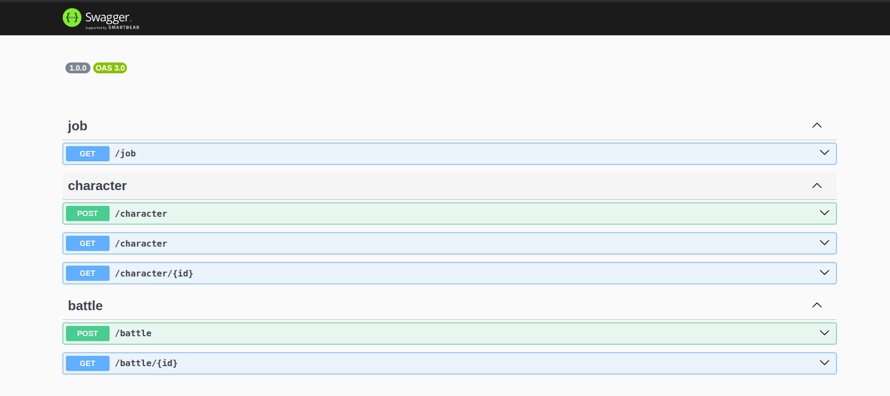
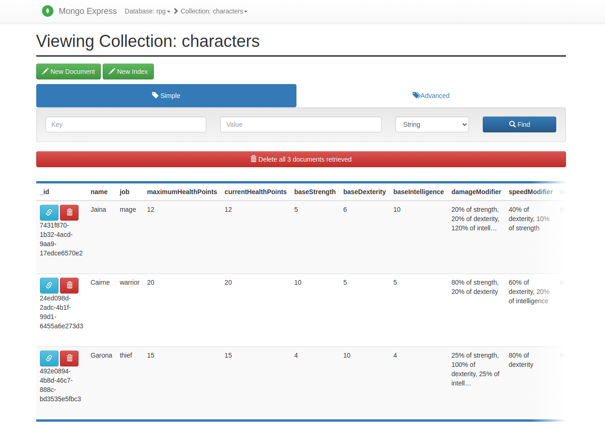

# Nest.js REST API RPG

This is an example backend for an RPG turn-based game.
It utilizes:

- languages:
  - [JavaScript](https://javascript.info/)
  - [TypeScript](https://www.typescriptlang.org/)
- frameworks
  - [Nest.js](nestjs.com) because it has all the functionality we need, is fast, and well documented
- architecture:
  - [Domain-driven Design (DDD)](https://en.wikipedia.org/wiki/Domain-driven_design) to separate business logic from framework and libraries, improve readability, extendability and maintainability, and to enforce [SOLID principles](https://en.wikipedia.org/wiki/SOLID)
  - [Hexagonal Architecture](https://en.wikipedia.org/wiki/Hexagonal_architecture_(software)) for better code organizing (this goes hand in hand with DDD)
  - [Command and Query Responsibility Segregation (CQRS)](https://en.wikipedia.org/wiki/Command_Query_Responsibility_Segregation) to create clear interfaces to read and modify data
  - [Value Objects](https://en.wikipedia.org/wiki/Value_object) to enforce data integrity througout the application and provide easier means to add functionality and/or validation
- libraries:
  - [@nestjs/mongoose](https://www.npmjs.com/package/@nestjs/mongoose) and [mongoose](https://www.npmjs.com/package/mongoose) as an ODM for storing and retrieving data
  - [@nestjs/swagger](https://www.npmjs.com/package/@nestjs/swagger) to generate API documentation from the code
  - [class-validator](https://www.npmjs.com/package/class-validator) to validate requests/user inputs before the data goes to the controllers
  - [date-fns](https://www.npmjs.com/package/date-fns) to make work with dates easier
  - [purify-ts](https://www.npmjs.com/package/purify-ts) to provide a funcional (and more readable) way of handling and avoiding null values and nested conditions
  - [uuid](https://www.npmjs.com/package/uuid) to generate IDs and primary keys for entities, commands, events and queries
  - [Lodash](https://lodash.com/) to provide utility functions for easier coding
- command line utilities:
  - [Docker](https://www.docker.com/) for stable environment
  - [Task](https://taskfile.dev/) for easier command line usage




## Requirements

- install [Docker](https://docs.docker.com/engine/install/)
- install [Task](https://taskfile.dev/installation) (optional)
  - if you don't want to use Task, you will need to type docker commands and their arguments manually

## Start the project

- run `task up`
  - this will spin up all docker containers, imports database seed, runs `npm i`, so it might take a minute or two
  - if you wish to see the progress, run `taks logs` or tail logs of specific containers until everything is ready

## Usage

- run `task --list-all` to list all available commands
- run `task down up logs` to restart the project and start tailing logs from all containers
- run `task down && sudo rm -rf mongo/data && task up` to re-seed database and start the project
- run `task test` to run tests
  - you can also run only a single suite `clear && task npm -- run test test/unit`
  - or a specific test `clear && task npm -- run test test/e2e/modules/rpg/infrastructure/delivery/http/BattleControllerSpec.ts`
- run `task npm <your-arguments>` to execute npm command inside the `nest` container; examples:
  - `clear && task npm -- run test`
  - `task npm -- install -g thanks`

This is how the test output should look like (if you run the tests on the seeded database):

```bash
task: [test] task npm -- run test
task: [npm] docker compose exec nest npm run test

> nest@0.0.1 test
> jest --config=test/jest.config.json

 PASS  test/unit/modules/rpg/domain/model/character/CharacterSpec.ts
  Character
    ✓ create (6 ms)
    ✓ prepareForAttack (1 ms)
    ✓ attack (1 ms)

 PASS  test/e2e/modules/rpg/infrastructure/delivery/http/JobsControllerSpec.ts
  JobController
    ✓ /job (GET) 200 (154 ms)

 PASS  test/e2e/modules/rpg/infrastructure/delivery/http/CharacterControllerSpec.ts
  CharacterController
    ✓ /character (POST) 200 (176 ms)
    ✓ /character (POST) 400 (29 ms)
    ✓ /character (GET) 200 (22 ms)
    ✓ /character/:id (GET) 200 (20 ms)
    ✓ /character/:id (GET) 400 (17 ms)
    ✓ /character/:id (GET) 404 (24 ms)

 PASS  test/e2e/modules/rpg/infrastructure/delivery/http/BattleControllerSpec.ts
  BattleController
    ✓ /battle (POST) 200 (214 ms)
    ✓ /battle (POST) 400 (32 ms)
    ✓ /battle (POST) 404 (34 ms)
    ✓ /battle/:id (GET) 200 (23 ms)
    ✓ /battle/:id (GET) 400 (18 ms)
    ✓ /battle/:id (GET) 404 (20 ms)

Test Suites: 4 passed, 4 total
Tests:       16 passed, 16 total
Snapshots:   0 total
Time:        4.695 s
Ran all test suites.
```

### Endpoints & URLs

- Swagger API documentation [http://localhost:3001/api](http://localhost:3001/api)
- Mongo Express [http://localhost:8081](http://localhost:8081)

## TODO

### Must-haves in a real-world project

- (de)serialization of commands, events, queries and views
  - this is needed to get rid of incorrect serialization of value objects and also a prerequisite for asynchronous command and event processing
- asynchronous command and event processing (we are already using command bus and event bus)
- correlation and causation ids for requests, commands, queries, events and arbitrary log message contexts
- error handling (e.g. mongoose connection failures, more validations)
- separate seeded MongoDB schema / [in-memory MongoDB server](https://www.npmjs.com/package/mongodb-memory-server) for tests
  - we don't want to modify the development data and create clutter by running the tests multiple times
- character list pagination
- character creation name uniqueness checking
- validate whether the characters are alive when creating new battle

### Nice-to-haves

- rewrite `BattleProcess` to use [Sagas](https://docs.nestjs.com/recipes/cqrs#sagas) from `Nest.js`
- add video/gif of using the Swagger and Mongo Express
- fix cyclic serialization issue of `BattleHasEnded`
  - it would be good to have this event present in the battle log, although the data in that event are not required by frontend (everything FE needs is in the previous events)
- A character should be designed with some future features in mind, which don't need to be implemented at this point in the project:
  - A character will be able to level up, at which point their core attributes will change (health, strength, dexterity, and intelligence)
  - A character will be able to change their job, resulting in calculations involving their modifiers to reflect their new job (attack modifier and speed modifier)
- event sourcing (aggregates are already prepared for it)
- graphql (as an alterantive to REST API)
- websockets (for auto-updates after creating/updating/deleting a battle)

## Resources

- [https://www.domainlanguage.com/ddd/blue-book/](https://www.domainlanguage.com/ddd/blue-book/)
- [https://docs.nestjs.com/](https://docs.nestjs.com/)
- [https://dev.to/sairyss/domain-driven-hexagon-18g5](https://dev.to/sairyss/domain-driven-hexagon-18g5)

## Lessons learned

- I need to read the instructions better and do not forget what it says
  - I had MongoDB database in place and connected to everything, then I read the instructions again only to see I should have used in-memory storage
  - I hope this won't become an issue
- I went into an issue with class inheritance and types with `Character` class and it's children, resulting into using a union type for its child classes
  - Next time, I would try to use object literals, types and function constructors instead of classes
  - Object literals would also allow to use destructuring and spread operator for object manipulation
  - Lastly, code would probably become much more readable and usable by frontend devs that are used to work with React.js
